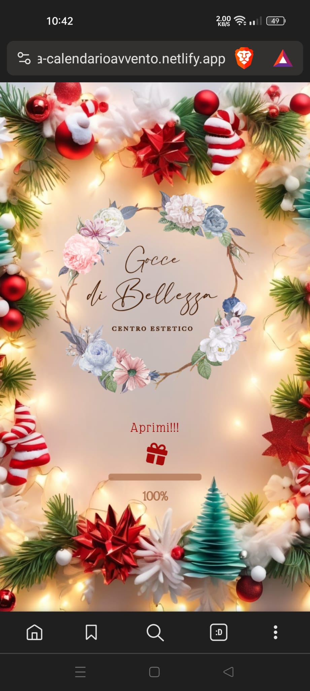

# Advent Calendar for Smartphones - Beauty Center

## Web address

Explore the application online [here](https://goccedibellezza-calendarioavvento.netlify.app/).

## Project Description

An advent calendar for a beauty center showcasing daily offers.

## Usage Instructions

1. Open index.html in your preferred web browser.
2. Scroll through the daily offers to view the promotions.

## System Requirements

- Modern web browser with enabled JavaScript.

## Project Structure

- /css: Contains style files.
- /js: Contains JavaScript files.
- index.html: Main application page.

## Installation

No installation required.

## Contributions

We welcome contributions! Fork the project and submit a pull request.

## License

This project is licensed under the <a href="https://github.com/AndreadeMartinis/JS-Christmas-calendar-app/blob/main/LICENSE" target="_blank">MIT License</a>.

## Release Notes

- **Version 1.0.0** (29/11/2023)

## Known Issues

- No known issues at the moment.

## Screenshots

    
    

## Note on Responsiveness

The application is optimized for smartphones, and while functional on desktop and tablet devices, detailed responsiveness for these platforms has not been a primary focus.
